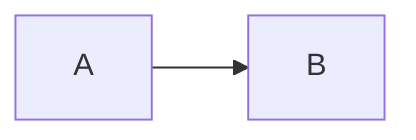

```latex
$$ x = \frac{-b \pm \sqrt{b^2-4ac}}{2a} $$
```
$$ x = \frac{-b \pm \sqrt{b^2-4ac}}{2a} $$
<p style="text-align:center">
这是一个居中的段落。
</p>

<h2 style="text-align:center">
这是一个居中的二级标题
</h2>
<p style="text-align:center">
    
</p>

