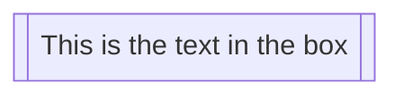
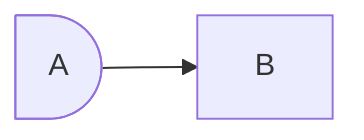
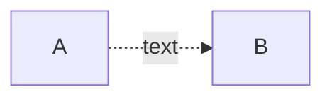
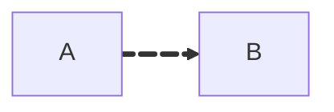

```mermaid
flowchart LR
    id1[[This is the text in the box]]
```


```mermaid
graph LR
  A@{ shape: delay } --> B@{ shape: rect }
```

[更多形状……](https://mermaid.js.org/syntax/flowchart.html)

---


```txt
flowchart LR
   A -. text .-> B

flowchart LR
   A-. text .-> B
以上两者等价
```

```mermaid
flowchart LR
   A -. text .-> B

```


```mermaid
flowchart LR
   A-. text .-> B

```


```mermaid
flowchart LR
  A e1@==> B
  e1@{ animate: true }

```

