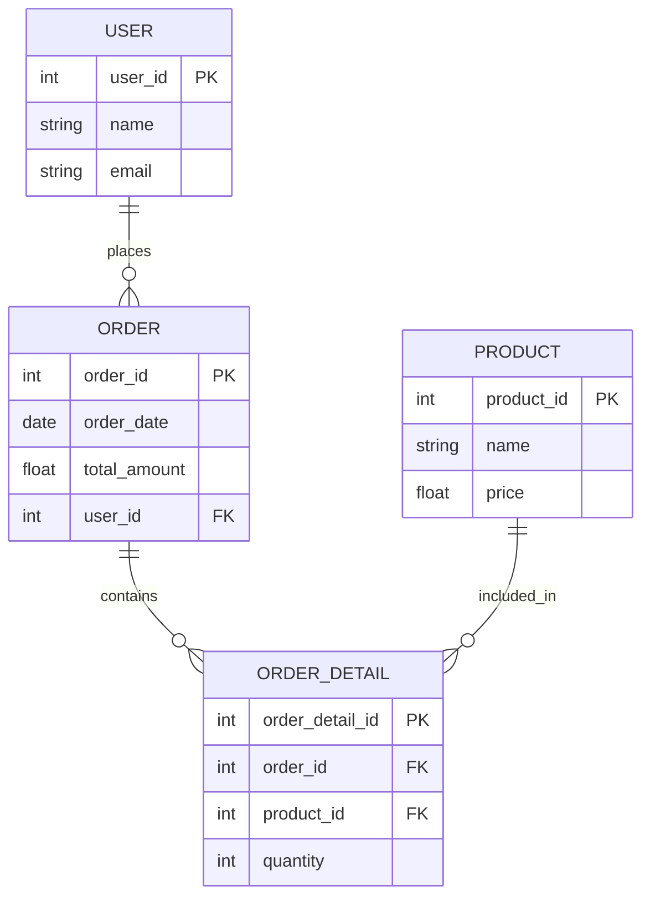
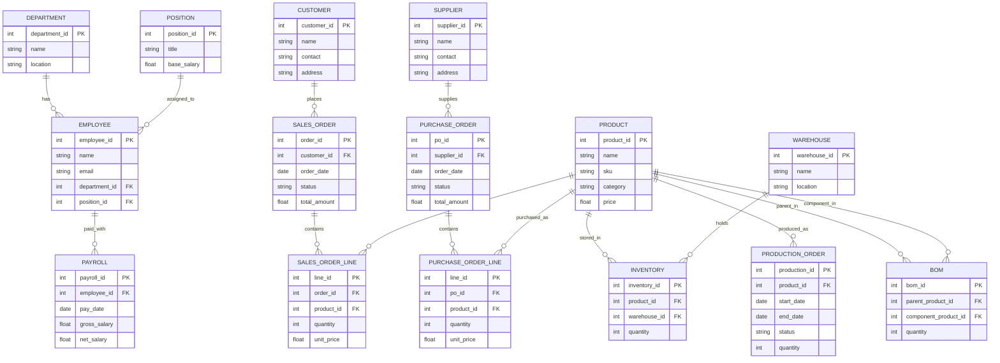

```mermaid
erDiagram
    USER {
        int user_id PK
        string name
        string email
    }
    ORDER {
        int order_id PK
        date order_date
        float total_amount
        int user_id FK
    }
    PRODUCT {
        int product_id PK
        string name
        float price
    }
    ORDER_DETAIL {
        int order_detail_id PK
        int order_id FK
        int product_id FK
        int quantity
    }

    USER ||--o{ ORDER : places
    ORDER ||--o{ ORDER_DETAIL : contains
    PRODUCT ||--o{ ORDER_DETAIL : included_in

```

```mermaid
erDiagram
    EMPLOYEE {
        int employee_id PK
        string name
        string email
        int department_id FK
        int position_id FK
    }
    DEPARTMENT {
        int department_id PK
        string name
        string location
    }
    POSITION {
        int position_id PK
        string title
        float base_salary
    }
    PAYROLL {
        int payroll_id PK
        int employee_id FK
        date pay_date
        float gross_salary
        float net_salary
    }

    CUSTOMER {
        int customer_id PK
        string name
        string contact
        string address
    }
    SALES_ORDER {
        int order_id PK
        int customer_id FK
        date order_date
        string status
        float total_amount
    }
    SALES_ORDER_LINE {
        int line_id PK
        int order_id FK
        int product_id FK
        int quantity
        float unit_price
    }

    SUPPLIER {
        int supplier_id PK
        string name
        string contact
        string address
    }
    PURCHASE_ORDER {
        int po_id PK
        int supplier_id FK
        date order_date
        string status
        float total_amount
    }
    PURCHASE_ORDER_LINE {
        int line_id PK
        int po_id FK
        int product_id FK
        int quantity
        float unit_price
    }

    PRODUCT {
        int product_id PK
        string name
        string sku
        string category
        float price
    }
    INVENTORY {
        int inventory_id PK
        int product_id FK
        int warehouse_id FK
        int quantity
    }
    WAREHOUSE {
        int warehouse_id PK
        string name
        string location
    }
    PRODUCTION_ORDER {
        int production_id PK
        int product_id FK
        date start_date
        date end_date
        string status
        int quantity
    }
    BOM {
        int bom_id PK
        int parent_product_id FK
        int component_product_id FK
        int quantity
    }

    %% HR relationships
    DEPARTMENT ||--o{ EMPLOYEE : "has"
    POSITION ||--o{ EMPLOYEE : "assigned_to"
    EMPLOYEE ||--o{ PAYROLL : "paid_with"

    %% Sales relationships
    CUSTOMER ||--o{ SALES_ORDER : "places"
    SALES_ORDER ||--o{ SALES_ORDER_LINE : "contains"
    PRODUCT ||--o{ SALES_ORDER_LINE : "sold_as"

    %% Procurement relationships
    SUPPLIER ||--o{ PURCHASE_ORDER : "supplies"
    PURCHASE_ORDER ||--o{ PURCHASE_ORDER_LINE : "contains"
    PRODUCT ||--o{ PURCHASE_ORDER_LINE : "purchased_as"

    %% Inventory & Production
    PRODUCT ||--o{ INVENTORY : "stored_in"
    WAREHOUSE ||--o{ INVENTORY : "holds"
    PRODUCT ||--o{ PRODUCTION_ORDER : "produced_as"
    PRODUCT ||--o{ BOM : "parent_in"
    PRODUCT ||--o{ BOM : "component_in"

```
