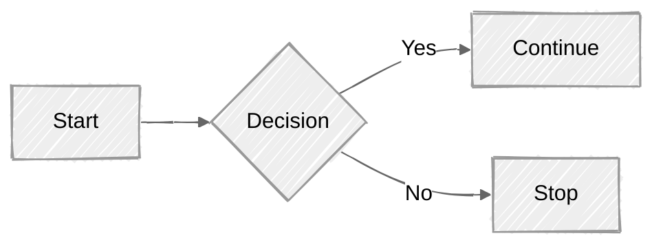

# 原理

- mermaid由node.js驱动，使用npm安装，可用于前端网络设计。
- 在前端中，通过以下方式使用：
```javascript
<script type="module">
  import mermaid from 'https://cdn.jsdelivr.net/npm/mermaid@11/dist/mermaid.esm.min.mjs';
  mermaid.initialize({ startOnLoad: true });
</script>
```
浏览网页的时候，表格代码被渲染为`svg`图片。


# basic demo


---

## Flowchart
---


> `graph TD;`起始，按照缩进分级，每一段以`;`结尾。

## SequenceDiagram
---


### [XY Chart](https://mermaid.js.org/syntax/xyChart.html)


> 轴刻度根据所取范围自动分化


# 编辑器基础

## Maikdown链接演示
---
[](https://mermaid.live/edit#pako:eNpFkcFOhDAQhl-FnZMmLJTCttCDibrJXj14Ujx0aaEk0JJSVNzl3S2osXPo_Pmn33TaC1RGSGDQWD6o4PlY6sCv-9cnbt38Fuz3d9eTdEFvtJyvwcPNyQSjMsPQ6ma3u_2phtAfbwUwZycZQi9tz1cJl9UvwSnZyxKYT2tj5ehKCH-dTayGkl1ngg9jO1FCqRfPHLh-Mab_w1ozNQpYzbvRq2kQ3Mljy_3F_0ukFtI-mkk7YGQjALvAJ7CMoChPaZHmFGWU5lkIM7CEkihFGaYFLjKMfCwhfG09UXQg6IAKhNftQKjHdYZ7_EqsjK7bZs0m2_lBlXPDyOK4aUcXNa1T0zmqTB-PrVD-IdV7QWKCSc5xKglN-SFNRXVOirzGWVILihLMwfd287B9hsfAsnwD7jN-tw)

## 美化
---



> 以下样例包含常用的颜色设置，图形形状以及结构。


更多自定义主题设置：
[Theme Settings](https://mermaid.js.org/config/theming.html)